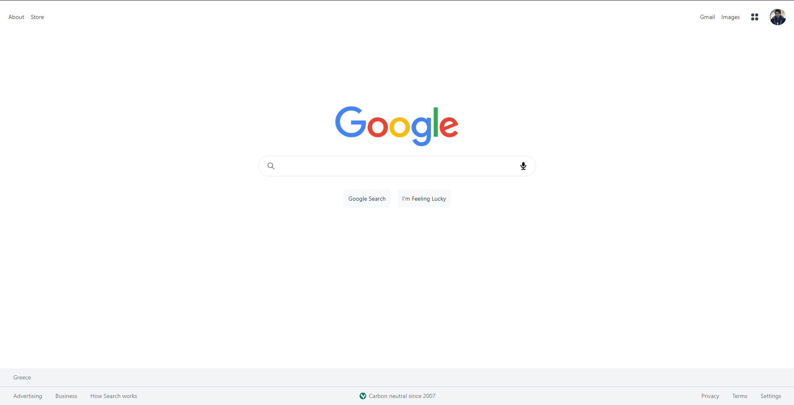
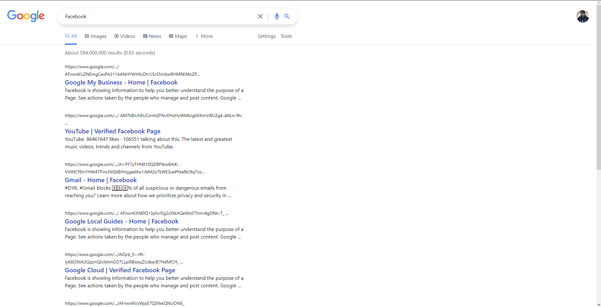

# Google Clone

A Google clone using [Next JS](https://nextjs.org), [Tailwind CSS](https://tailwindcss.com) & [Heroicons](https://heroicons.com) for the front-end and the [Google Programmable Search Engine](https://developers.google.com/custom-search?authuser=1). Inspired by [this tutorial](https://www.youtube.com/watch?v=24xpTmaPOdY&t=171s)

<div align="center">
  <h1><a href="https://google.constantine.dev"> DEMO </a></h1>
</div>

## Requirements

Inside the repo there is a [.env.example file](./google/.env.example). Rename it to .env.local and fill the values with your own api keys.

For the google api you will need an api key and a context key.

```javascript
NEXT_PUBLIC_GOOGLE_API_KEY=
NEXT_PUBLIC_CONTEXT_KEY=
```

## Installation

Assuming you have [npm](https://www.npmjs.com) or [yarn](https://www.yarnpkg.com) installed, clone the repo and run the following code:

```
npm install

or

yarn install
```

## Usage

Inside the cloned folder run:

```
npm run dev

or

yarn dev
```

## Example

<p align="center">
   
   
</p>
